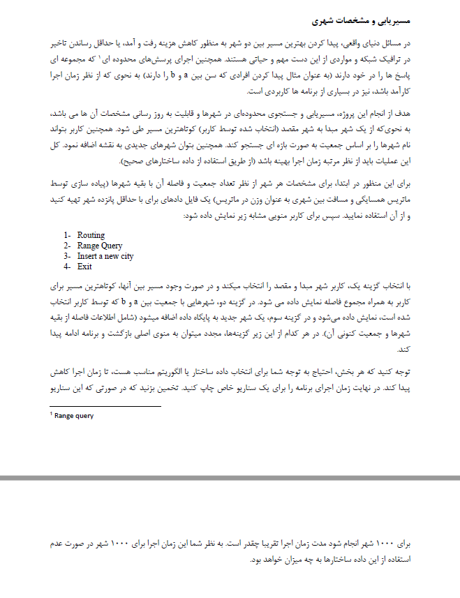
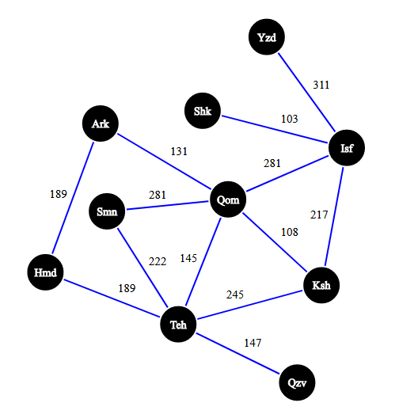

# Data Structure Project

For more information see [www.baeldung.com](https://www.baeldung.com/java-dijkstra)

##How to use?
1. Install maven: [see here](https://www.javatpoint.com/how-to-install-maven)
2. Clone the project into a directory   
3. Open cmd and move to the project directory
4. Run the following command:
  > mvn exec:java -Dexec.mainClass="com.example.Main"

##Information
The image below shows a simple graph of the initial state of the project with real distances.
we are trying to find the shortest route between different cities.
for example what is the shortest route between the cities of **Isfahan** and **Hamedan**?

How can we get a range of city populations as shown below?

.png)

